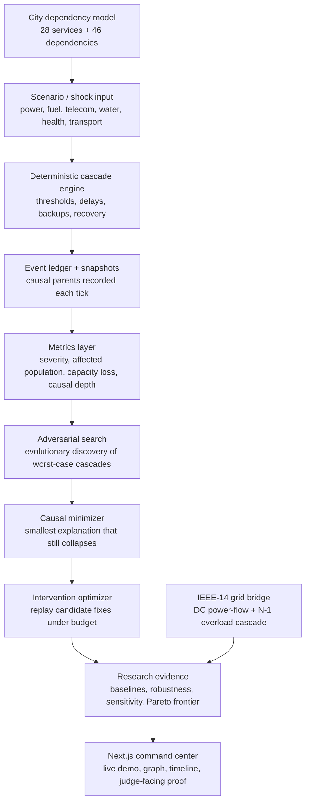

# Architecture

## Execution pipeline

`Scenario → discrete simulation → event ledger + snapshots → severity/collapse predicate → minimizer → intervention replay`

The simulation package has no React imports. `city-model.ts` defines the synthetic topology. `propagation-engine.ts` applies active shocks, due dependency effects, finite backups, recovery, status transitions, and event recording each tick. Dependency effects are queued once when a source crosses its requirement; causal parent event IDs connect downstream evidence to originating events.

`metrics.ts` derives service availability, affected population, hospital/water/emergency capacity, economic disruption, failed nodes, causal depth, recovery time, and severity. `evolutionary-search.ts` evaluates genuine simulation results. `causal-minimizer.ts` preserves a measurable collapse predicate while deleting/reducing conditions. `intervention-optimizer.ts` replays cost-ordered model mutations and accepts only safe outcomes.

The Next.js UI consumes immutable snapshots. React Flow renders dependency topology; Recharts plots time-series metrics. The demo is a deterministic presentation controller over the same simulation result.

## Determinism

Scenario fixtures are fixed. Random and evolutionary modes use a local seeded linear-congruential generator. The engine has no wall-clock, network, or global randomness dependency.

## Simplifications

Capacity is a normalized scalar rather than domain-specific physical state. Effects are thresholded and additive. Interventions are single changes, not combinations. Search runs synchronously in fast mode because the prototype population is small; a production-scale graph should move search to a Web Worker.
